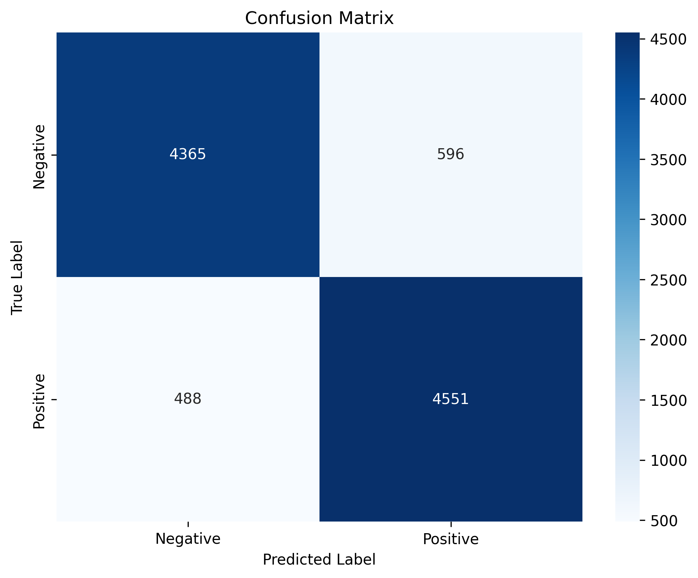
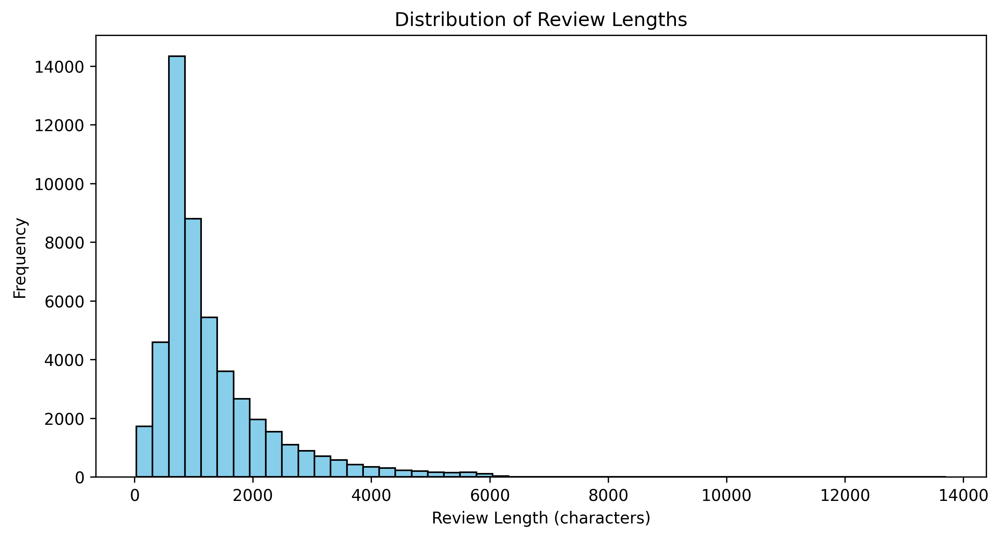

# 🎬 IMDB Sentiment Analysis

A machine learning project that analyzes movie reviews and predicts whether they are positive or negative using Natural Language Processing (NLP) techniques.


---

## 📋 Table of Contents

- [About](#about)
- [Dataset](#dataset)
- [Project Pipeline](#project-pipeline)
- [Results](#results)
- [Technologies](#technologies)
- [Installation](#installation)
- [Usage](#usage)
- [Project Structure](#project-structure)
- [Key Learnings](#key-learnings)
- [Future Improvements](#future-improvements)
- [License](#license)

---

## 🎯 About

This project demonstrates a complete machine learning workflow for **sentiment analysis** on movie reviews. The model classifies IMDB movie reviews as either **positive** or **negative** with **89.16% accuracy**.

The project covers:
- Text preprocessing and cleaning
- Feature extraction using TF-IDF
- Training a Logistic Regression classifier
- Model evaluation and visualization
- Saving and deploying the trained model

---

## 📊 Dataset

**Source:** [IMDB Dataset of 50K Movie Reviews](https://www.kaggle.com/datasets/lakshmi25npathi/imdb-dataset-of-50k-movie-reviews?resource=download)

- **Total Reviews:** 50,000
- **Positive Reviews:** 25,000
- **Negative Reviews:** 25,000
- **Format:** CSV file with two columns (`review`, `sentiment`)

The dataset is perfectly balanced, making it ideal for binary classification tasks.

---

## 🔄 Project Pipeline

### 1. **Data Loading & Exploration**
- Loaded 50K movie reviews
- Performed exploratory data analysis (EDA)
- Analyzed review length distribution
- Checked for missing values and data quality

### 2. **Text Preprocessing**
- Removed HTML tags and special characters
- Converted text to lowercase
- Removed stopwords (e.g., "the", "is", "and")
- Cleaned and tokenized text data

### 3. **Feature Engineering**
- Applied **TF-IDF Vectorization** (Term Frequency-Inverse Document Frequency)
- Extracted top 5,000 features (most important words)
- Converted text data into numerical vectors

### 4. **Model Training**
- Split data: 80% training (40,000 reviews), 20% testing (10,000 reviews)
- Trained **Logistic Regression** classifier
- Training time: ~0.32 seconds

### 5. **Model Evaluation**
- Evaluated on test set (10,000 unseen reviews)
- Generated confusion matrix and classification report
- Created visualizations (Word Clouds, metrics)

### 6. **Model Deployment**
- Saved trained model using pickle
- Created prediction function for new reviews

---

## 🏆 Results

### Visualizations

#### Confusion Matrix


#### Word Clouds - Most Frequent Words


#### Review Length Distribution


### Model Performance

| Metric | Negative | Positive | Overall |
|--------|----------|----------|---------|
| **Precision** | 0.90 | 0.88 | 0.89 |
| **Recall** | 0.88 | 0.90 | 0.89 |
| **F1-Score** | 0.89 | 0.89 | 0.89 |
| **Support** | 4,961 | 5,039 | 10,000 |

**Overall Accuracy: 89.16%**

### Confusion Matrix
```
                Predicted
                NEG    POS
Actual NEG    [4365]  [596]
Actual POS    [488]  [4551]
```

- ✅ **4,365** negative reviews correctly classified
- ✅ **4,551** positive reviews correctly classified
- ❌ **596** false positives (negative → positive)
- ❌ **488** false negatives (positive → negative)

### Example Predictions
```python
predict_sentiment("This movie was absolutely amazing!")
# Output: POSITIVE 😊 (Confidence: 95.2%)

predict_sentiment("Terrible film. Waste of time and money.")
# Output: NEGATIVE 😞 (Confidence: 100.0%)

predict_sentiment("Best movie I've ever seen! Incredible acting!")
# Output: POSITIVE 😊 (Confidence: 98.0%)
```

---

## 🛠️ Technologies

- **Python 3.13**
- **pandas** - Data manipulation and analysis
- **NumPy** - Numerical computing
- **scikit-learn** - Machine learning models and tools
- **NLTK** - Natural language processing
- **Matplotlib & Seaborn** - Data visualization
- **WordCloud** - Text visualization
- **Jupyter Notebook** - Interactive development environment

---

## 📦 Installation

### 1. Clone the repository
```bash
git clone https://github.com/your-username/imdb-sentiment-analysis.git
cd imdb-sentiment-analysis
```

### 2. Install required packages
```bash
pip install pandas numpy scikit-learn matplotlib seaborn nltk wordcloud jupyter
```

### 3. Download the dataset

Download the dataset from [Kaggle](https://www.kaggle.com/datasets/lakshmi25npathi/imdb-dataset-of-50k-movie-reviews?resource=download) and place `IMDB Dataset.csv` in the project directory.

---

## 🚀 Usage

### Run the Jupyter Notebook
```bash
jupyter notebook imdb_sentiment_analysis.ipynb
```

### Use the trained model
```python
import pickle

# Load the model
with open('sentiment_model.pkl', 'rb') as f:
    model = pickle.load(f)

# Load the vectorizer
with open('tfidf_vectorizer.pkl', 'rb') as f:
    tfidf = pickle.load(f)

# Make predictions
def predict_sentiment(text):
    cleaned = clean_text_v2(text)
    vectorized = tfidf.transform([cleaned])
    prediction = model.predict(vectorized)[0]
    return "POSITIVE" if prediction == 1 else "NEGATIVE"

# Test it
print(predict_sentiment("This movie is amazing!"))
# Output: POSITIVE
```

---

## 📁 Project Structure
```
imdb-sentiment-analysis/
│
├── imdb_sentiment_analysis.ipynb   # Main Jupyter notebook
├── IMDB Dataset.csv                # Dataset (download separately)
├── sentiment_model.pkl             # Trained model
├── tfidf_vectorizer.pkl            # TF-IDF vectorizer
├── README.md                       # Project documentation
└── requirements.txt                # Python dependencies
```

---

## 💡 Key Learnings

Throughout this project, I gained hands-on experience with:

1. **Text Preprocessing Techniques**
   - HTML tag removal
   - Stopword elimination
   - Text normalization and cleaning

2. **Feature Extraction**
   - Understanding TF-IDF (Term Frequency-Inverse Document Frequency)
   - Converting text to numerical features
   - Feature selection and dimensionality

3. **Machine Learning Workflow**
   - Train/test split methodology
   - Model training and hyperparameter tuning
   - Cross-validation concepts

4. **Model Evaluation**
   - Accuracy, Precision, Recall, F1-Score
   - Confusion Matrix interpretation
   - Understanding false positives/negatives

5. **Data Visualization**
   - Word clouds for text data
   - Confusion matrix heatmaps
   - Distribution analysis

6. **Model Deployment**
   - Saving models with pickle
   - Creating prediction functions
   - Building reusable ML pipelines

---

## 🔮 Future Improvements

- [ ] Experiment with advanced models (Random Forest, SVM, Neural Networks)
- [ ] Implement LSTM or BERT for better context understanding
- [ ] Add support for neutral sentiment classification
- [ ] Create a web interface using Flask or Streamlit
- [ ] Perform hyperparameter tuning for better accuracy
- [ ] Deploy model as a REST API
- [ ] Add multi-language support

---

## 📄 License

This project is licensed under the MIT License - see the [LICENSE](LICENSE) file for details.

---

## 🙏 Acknowledgments

- Dataset provided by [Lakshmi Narayana](https://www.kaggle.com/lakshmi25npathi) on Kaggle
- Inspiration from various NLP and sentiment analysis tutorials
- scikit-learn documentation and community